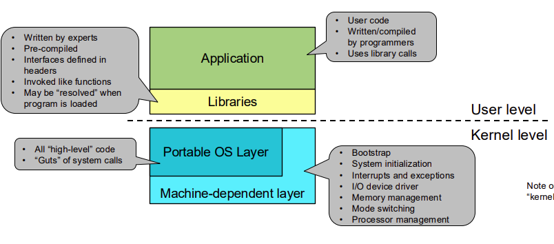

# Operating System

> Kernal $\approx$ OS

# Software of a Unix System

### Application

-   user code
-   use library calls

### Libraries

-   pre-compiled
-   written by experts

### Portable OS Layer

-   all high level codes
-   system calls

### machine-dependent layer

-   bootstrap
-   IO device driver
-   interrupts and exceptions
-   mem mangement

# Protection

### CPU modes:

-   Kernal mode - can run all instructions
-   User mode - can only run non-priviledged instructions
-   Mode is indicated by a mode bit in a protected CPU control register

## Priviledgd Instructions

> a subset of instructions that **can only run in kernal mode**

-   the CPU checks **mode bit** when priviledged instructions execute
-   if the mode bit is set to user mode, the CPU will raise an [exception](#exceptions)

### Priviledged Instructions Can DO:

-   Directly access IO devices (disk, network, etc.)
-   manipulate memory management (page tables, etc.)
-   manipuate CPU protected control registers (mode bit, etc.), preventing user code from changing the mode bit

**HLT**: halts the CPU

## Memory Protection

> prevents user code from accessing kernal memory, Seperation of user and kernal memory

!!! note annotate "should programs trust OS?"

    may/may not be trusted, but the OS should not trust the programs

# OS Events

> unnatural change in the flow of control
>
> -   stops current execution
> -   change mode, context or both

OS defines handlers for these events, event handlers are executed in **kernal mode** after system booted, **all** entry
to kernal occurs as result of an event

???+ OS kernal

    OS itself is a big event handler

    OS only executes in response to an event

## interrupts
> cause by external event

## exceptions
> caused by program execution instructions
- fault: eg: try execute priviledged instruction in user mode
- system calls: eg: request kernal service

events can be **unxpected** or **deliberate**
