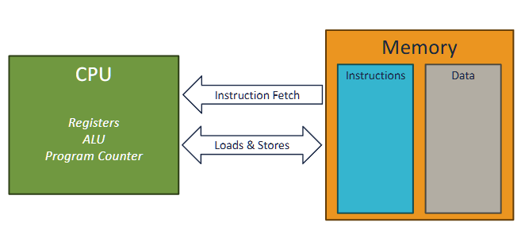

# Cache

Created: February 13, 2025 4:03 AM
Tags: Computer Hardware

<aside>
💡

1 byte = 8 bits, 1 hex = 1 nibble = 4 bits, 1 KB = 1024 Bytes, 1 cycle = 0.3 nanoseconds

</aside>

<aside>
💡

index of array is essentially offset of memory location, so they start with 0

</aside>

- cache should store Frequently accessed, computationally expensive, or slow-to-retrieve data (e.g., database queries, API responses, session data).
- cache is stored in hashmap (key value pairs)
- cache is put in different storage based on speed and persistence
- check if key exists before query data from memory
- use LRU (least recently used), or LFU (least frequently used), or TTL (time to live) to manage cache
- if cache miss, retrieve from original mem location

### common system time

| System Event | Actual Latency | Scaled Latency | typical CPI |
| --- | --- | --- | --- |
| One CPU cycle | 0.3 ns | 1 second | 1 cycle |
| Level 1 cache access | 0.5 ns | 2 seconds | 4 cycles |
| Level 2 cache access | 2.8 ns | 10 seconds | 25 cycles |
| Level 3 cache access | 28 ns | 2 minutes | 50 cycles |
| Main memory access (DDR DIMM) | 100 ns | 7 minutes | 400 cycles |
| SSD I/O | 50–150 μs | 1.5–4 days | 100000 cycles |
| Rotational disk I/O | 1–10 ms | 1–9 months |  |
| Internet packet: San Francisco to Europe and back | 150 ms | ~10 years |  |

## classic von neuman computer

### memory wall

> Memory performance improved at a much slower rate than processor performance.
> 

## Memory access is expensive

- if a non memory operation uses 1 cycle, a memory access opeeration would take ~ 500 cycles

> caching reduce CPI by access faster memories
> 

### memory techs

1. registers: 0.5 cycles (0.5ns)
2. SRAM (static random access memory): 4-50 cycles (**cache**)
3. DRAM: 400 cycles
4. NAND (SSD): 100000 cycles
5. hard disk

### calculate for CPI:

for 100000 k iterations, there are:

1. 500 + 1 + 1 + 1 = 503 cycles per each iteration

there are 100000 * 503 = 50300000 CPI  in total, and there are 3 + 3 + 2 + 4*100000 + 2 = 400010 dynamic instructions, so CPI = $50300000 / 400010 = 125.7$ (or 503 / 4)

### optimize memory access by parallelism  (Amdahl’s law)

- we can only optimize the part x where it is parallezable. in this case,

- since k is large, we can assume iterations takes the entire execution time
- inside each iteration, `addl (%rax) %edx` is a memory access operation and its result edx is not used for later calculations, therefore it can be paralleized
- therefore,

$$
x = \frac{\text{CPI of part that can be paralleized}}{\text{CPI total per iteration}} = \frac{500}{503} =  0.994
$$

<aside>
💡

NOT SURE

</aside>

# Memory access pattern/Cache

> caching reduce CPI by access faster memories
> 

### cache

1. faster than main memory
2. usually made out of SRAM

<aside>
💡

a hash map cache table stores the value in a virtual memory location 

</aside>

**3 layers of cache in modern computer** 

with 64 bytes per cache line

a cache is small, but close to processor

memory access will try go to cache first 

**cache hit**

cache miss **-** data is not in cache 

### multi level cache

last level cache - L3, LLC, the cache just before main cache 

L1 (cloest to processor), L2, l3

<aside>
💡

cache only manipuate cache lines

where a cache line’s address is always a multiple of cache line size,

</aside>

<aside>
💡

purpose of memory hierachy: 
1. provide fast memory access in most cases
2. hide the slowness of DRAM from application (by caching in SRAM )
3, exploit locality to improve performance 

</aside>

### memory locality

based on: future memory access is predictable based on past access

**spatial locality -** programs tend to access memory close in address to the data they have been accessed recently

- will divide an array into multiple data chunks, whenever a data in the chunk is loaded the entire chunk will be loaded

**temporal locality -** programs tend to access same data repeatedly

- if run out of space, evict cache lines based on evication policy. new cache is always added

### calculate cache line

**cache line:**  smallest unit of data that can be transferred between main memory and cache, consists of multiple consecutive bytes (spatial locality)

**cache address:** refer to location of memory block within a cache

$$
\text{cache line addr of A} = A - A \text{ mod } 2^k
$$

- where 2^k is the cache line size

**unified cache** : A cache that holds both instructions and data.

<aside>
💡

since 1 byte = 2 hex, 16 bytes cache line = 4 ints  
each cache line starts with address 0x…0, eg: 0x1000, 0x1020. 

</aside>

---

example: 

- each element in the students array is unsigned int of 32 bits, or 4 bytes.
- therefore, $addr(student[i]) = 0x1004 + 4i$
- suppose the cache lines is 16 bytes, the cache line number is

$$
\text{cache line idx} = \frac{\text{memory address}}{\text{cache line size}}
$$

- since cache line is 16 bytes, therefore, there is 4 students object stored in each cache line,
- since the bit offset is 4 (2 ^ 4 == 16), therefore, the first 3 hex number defines a set,
- therefore, 0-2 (0x1004 - 0x100c), 3-6 (0x1010 - 0x101C), 7 - 10  is stored in the same cache line. since within each set, the first 3 hex digit is same.
- so answer is D

### Cache as hashtable:

- to ensure O(1) access and store time
- use tags to acces the cache line, and then use index bits to access a specific location.

<aside>
💡

hashtable: group by : index bits → tag → memory contents (as k bit offset)

cache line : tag → index → offset

</aside>

A **64-bit address** is divided into three parts:

1. **Offset (k-bit offset)**
    - Determines **which byte** within a cache line to access.
    - If the **cache line size = 2^k bytes**, the offset is **k bits**.
    - Example: For **16-byte ( 2^4 ) cache lines**, the **offset = 4 bits**.
2. **Index (Log(cache lines) index bits)**
    
    > The portion of an address that determines the possible locations of a cache line in the cache.
    > 
    - Selects **which cache line** to use.
    - If there are **2^n cache lines**, the index requires **n bits**.
    - Example: If the cache has **256 ( 2^8 ) cache lines**, the **index = 8 bits**.
    
    <aside>
    💡
    
    note: if use N-way set associative, the total number of indices = total number of associative sets = 2^n / N
    
    </aside>
    
3. **Tag (Remaining bits)**
    - Used to **differentiate memory blocks** mapped to the same cache index.
    - The CPU **compares the tag** of the requested address with the stored tag in the cache.
    - Example: If **64-bit addresses**, and offset + index uses **12 bits**, then **tag = 64 - 12 = 52 bits**.

<aside>
💡

for example, a memory location `1100 1010 1111 1110 1011 1010 1011 1110` stored at the cache set `11` = 3, at block by tag `1100 1010 1111 1110 1011 1010 1011`, and the `10` = 2 byte within that block

</aside>

### When accessing memory:

1. The **Index** selects the cache line.
2. The **Tag** stored in that cache line is **compared** with the tag from the address.
3. If the tags **match** → **Cache Hit** (data is retrieved from cache).If the tags **don’t match** → **Cache Miss** (data is fetched from main memory).

<aside>
💡

always loads the entire block tag represents to the cache. 

</aside>

## Cache Metrics

$$
\text {hit rate} = \frac{\text{number of hits}}{\text{number of accessses}}
$$

$$
\text {miss rate} = \frac{\text{number of misses}}{\text{number of accessses}}
$$

**memory latency**:  The time it takes to access a cache or main memory.

**Memory bandwidth**: The number of bytes per second that can be transferred to or from a cache or memory.

### total CPI with cache misses

---

example : 

In the absence of cache misses, processor takes an average of 2 cycle(s) to execute an instruction. If an L1 cache miss occurs, it takes an *additional* 18 cycles to access the L2.

On this processor, for a particular program an L1 miss rate of 30%. 5% of the instructions access memory.

What is the total CPI for the program?

$$
2 + 0.05*0.3 * 18=2.27
$$

### type of cache misses

> 3Cs: Compulsory, Capacity, Conflict misses
> 

**compulsory misses:** Misses that occur because the cache has not been accessed
before

- reduce cache line size (therefore fetches less data on miss, and does not exploit spatial locality) increase compulsory misses

**capacity misses:**  Misses that occur because the cache is too small.

- Misses that are not compulsory and would still occur in fully-associative cache with the same number and size of cache lines

**conflict misses:** Misses that occur because the indexing scheme and eviction policy
caused a cache line to be evicted.

- Definition: Misses that are not compulsory and wou**ld not occur in a
fully-associative cac**he the same number and size of cache lines
- increase cache line size (thus decrease the number of cache blocks and therefore same access pattern compete for fewer blocks) and  reduce associativity increase conflict misses
- **fully associative** eliminate all conflict misses, but much more expensive

---

example

- 0 : store. so we have index: 1, tag = 001,  compulsory miss
- 1: load, so store cache line index = 0, tag = 000, compulsory miss
- 2: store, index = 1, tag = 0, evict previous, compulsory (since it is first time access)
- 3: store, index = 1, tag = 1, evict previous, capacity miss (even it is fully associatetive, we cannot avoid this miss)
- 4: load, index = 1, tag = 1, cache hit
- 5: index = 1, tag = 0, conflict miss, because if we have fully associative cache, then result from 2, 3 will all be cached and this will be a cache hit.
- 6: index = 0, tag = 0, cache hit
- 7: index = 0, tag = 1, compulsory miss, first time access this

# eviction

> occurs when we need to make space in cache for a new line
> 

**eviction policy -**  determines when to evict a cache line

- in this course, always make room for new cache line
- has impact on cache hit rate

**writeback -** when a cache line is evicted and it is dirty (modified)

- cache write it back to next layer of memory hierachy  if dirty
- load the cache line from the next level of memory hierachy

## Evication policies

### **least recently used (LRU):**

- the simple and good solution, evict the cache line that was used farthest in the past
- HOWEVER, it is hard to implement in hardware

### random replacement policy:

> evicts a block chosen at random, regardless of usage.
> 

### First In First Out (FIFO) replacement policy

> policy evicts the block that was loaded into the cache the earliest.
> 

---

example: (suppose only temporal cache)

suppose the cache has 4 cache lines, 4 bytes per line, 32 bits addresss and 28 tag bits with 2 bit index and 2 bit offset

so this will perform: 

1. first try to load A[0] with tag (the higher address bits > 4, in this case, 0-3 bits). so tag = 0001, then store the index bits (4 elements per cache line), so store 00 as 0. 
2. then cache miss B[0] with tag = 0011 and index bits = 00
3. similarly, store A[1], B[1]. **those are compulstory cache misses**
4. and second run all hits cache, therefore, hit rate is 50%

---

suppose there is only  2 lines in cache, then the cache hit rate is 0%, because in our case, when run out of cache lines, it will replace the first one inserted . **cache miss due to capacity**

---

**suppose with spatial locality and index bits = 1, offset bits = 3, and #cache lines = 4,** this time each cache line should have 2 elements (A[0], B[0]), and they should loaded together. in this case,:

- miss when laod A[0], a[1],A[0] is loaded to cache
- miss when load B[0], B[0], B[1] is loaded to cache
- all later 6 access hits cache
- therefore hit rate is 75%

---

same hit rate if loaded reversely (A[1]), since the entire block is loaded no matter what

---

suppose k (the number of iterations) for both loop increase to 4, and index bits = 1, offset bits = 3. then the cache hit rate is 

- cache miss A[0] → load A[0], A[1]
- cache miss B[1] → load B[0], B[1]
- cache hit A[1], B[1]
- cache miss A[2] → load A[2] A[3] in place of A[0] A[1]
- cache miss B[2] →load B[2] B[3] in place of B[0] B[1]
- cache hit A[3], B[3]
- repeat again

therefore, the hit rate is 50%

---

[more cache simulations](https://www.notion.so/more-cache-simulations-19e81cb71af0809b99abc6abcdc51a83?pvs=21)

# Cache optimization Techniques

**working set:** data the programmer currently working on

**operational definition:** smallest cache size for which there are few capacity misses

### direct-mapped cache

> each memory address maps to exactly one cache line.
> 

---

suppose 2 cache lines, 1 index bit, which of following has higher cache hit rate?

original: 50%

A: 50%

B: 75% , note: cache miss A[0], cache hit A[0], A[1], A[1]. repeat for all 

C: 50%

**loop interchage / renesting:** 

the working set size: 16 bytes = 4 ints * 4 bytes per int +  4 ints * 4 bytes per int

- Although `A[]` and `B[]` **together take 32 bytes in total**, the **loop splitting technique** ensures that **only part of them is in use at a time**.
- The inner loop operates on `A[j]` and `B[j]`, keeping memory usage lower at each step.
- This **reduces the active working set size** at any given moment.

---

loop renesting + loop spliitng:

we only need 1 cache line with 1 content (one content in a cache line)

1. miss A[0], hit A[0]
2. ….

so 50%hit rate

### Cache conflicts

- there is room for cache, but indexing is too restrictive, causing coliision in hash table

- in this case, since index biits is 1,  we only take the 4th bit for indexing. however, look at each case:
    - 16 = `0001 0000` 4th bit is 0
    - 20 = `0001 0100` 4th  bit is 0
    - …
    - notice all 4th bit is zero, therefore, all index is 0, and therefore only 1 content for each tag. so they can only use one cache line. therefore, all cache would have the same index, so all will stuck in the same cache line, and not use anything else. therefore, each cache is overwritten. so no cache hit

## associativity, fully associative cache

<aside>
💡

the fully associative cache does not use **index,** cache line can live anywhere. but the cache needs to search everywhere. associate cache is expensive since needs to compare all stored caches 

</aside>

- does not use index, but require to search all cache lines for matched tags
- allows to store multiple blocks in a cache set simutaneously
- **fully associative cache eliminate conflict misses**

### cache with associativity

- suppose associativity  = 2, which means 2 of the cache lines do not use index but search all associated cache lines when tag is inquered
- therefore, first cacheline would store A[0], A[1], second would store B[0], B[1]. the first A[0], B[0] are compulsive misses, others are all cache hits

## hybrid associative cache (N-way cache)

- the index becomes the index of an associative set. an associated set have N cachelines, and they are associated.
- and  we can implement LRU evication within a set

---

- although index bit are all 0. all elements are cache in the first associative set.

---

### prefetching

- bring data into the cache before its requested
- `prefetch (%eax)`

# Cache access behavior plot

In this program we linearly access an array of memory of size 2^N bytes (2^(N-2) integers). We count the total time.

# virtual memory

### address space

> each program runs as if it has its own memory. in 64 bits machine, address space should be 2^64 bytes.
> 

however, we can allocate more memory space than the entire physical space if we dont operation on them. this is virtualization 

### virtualization

> taking a physical resource (memory) and make it appear to behave differently than it does, usually more plentiful (eg: an program can have >42TB address space on 16GB of memory)
> 

it takes limited physical memory and use it to build nice and easy address management spaces 

### virtual to physical mapping

- memory virtualization works on pages, ~4KB
- each  process has a page table to store virtual to physical mapping for address space
    - and permission to CRUD memory
- programs can only operates on virtual addresses

<aside>
💡

page table is a tree, with a depth fixed to 5 levels in latest intel CPUs. best case **memory translation** 20 cycles

</aside>

## page

> A **page** is a **fixed-sized block of memory** used in a **virtual memory system**. It is the **basic unit of data transfer** between **RAM (physical memory)** and **storage (disk/SSD)**. Pages allow the **operating system (OS)** to efficiently manage memory and implement **paging-based virtual memory**.
> 
- every process has a single page table

### translation lookaside buffer (TLB)

- The TLB is usually pretty small and highly (sometimes fully) associative.
- The TLB lookup has to complete before instruction can finish executing.
    - To enforce memory protection.
    - Illegal accesses cause SIGSEGV
- The hit rate needs to be high

> page: a unit of address translation
> 

<aside>
💡

typically, L1 cache has 100 entries of TLB, L2 has 1000 entries

</aside>

- TLB usually have high hits, .
    - hits are fast
    - dont impact L1 time
    - on miss, CPU asyncly performs a lookup in the OS manageed page table
    - the table is in memory, so further cache misses are possible
- if L1 is too small
    - add L2, L3 TLB (unrelated to L2, L3 cache)
    - adopt even larger page sizes

### page offset

> specifies the exact byte location within a range
> 

$$
\text{page offset bits} = \log_2(\text{page size bytes})
$$

### virtual page number (VPN)

> the index of a virtual page in a virtual address space
The VPN is used in conjunction with the **page table** to look up the corresponding **physical page**.
> 

$$
VPN = \text{total virtual page address bits} - \text{page offset bits}
$$

- in a 32 bit virtual address space with 4KB pages, VPN is 20bits, $= 32 - \log_2(4*1024) = 32 - 12 = 20$

### physical page number (PPN)

> The **PPN (Physical Page Number)** represents the **index of a physical page** in the physical memory.
> 
- The OS and **Memory Management Unit (MMU)** use the VPN to find the corresponding **PPN** in the **page table**.
- The **PPN + Page Offset** forms the **physical address**.
- In a **32-bit physical address space** with **4KB pages**, the PPN consists of **20 bits**.

$$
PPN = \text{physical address bits} - \log_2(\text{page size bytes})
$$

### convert from VPN to PPN

$$
\text{virtual address} = VPN + \text{page offset}\\
\text{physical address} = PPN + \text{page offset}
$$

- PPN has a smaller range compare to VPN
- VPN is mapped to PPN, but not reverse versa. it is a one way map direction from VPN to PPN. there could be multiple VPN that points to same PPN
- the page offste of PPn and VPN is same

---

---

the page offset bits = log_2 (4*1024) = 12, therefore, the lower 3 hex value is ignored (because page offset is ignored). then, since the remaiing `ce66e` ≠ `ce66f` , they belong to different page 

---

Your program has a TLB miss rate of 0.03% and a cache miss rate of 0.1%.
TLB misses add 12 cycles to the execution time of an instruction while cache misses add 11 cycles to the execution time of your program.

You have to decide between optimizing to reduce cache misses or TLB misses. Which should you optimize for?

(a)Cache misses

(b)TLB misses

A, because cache miss has higher miss rate? 

---

example: 

- since the array start address is 4kb-aligned. therefore, address intervals are: `0-4kb`, `4kb-8kb`
- each element is 8 bytes, in a single page of `4kb`, therfore, there are 4096 / 8 = 512 elements.
- therfore, element 1 is in second page, while element 2 is in first page, not in the same page

# summary

- bigger cache
    - will generally have higher hit rates, lower cache miss
    - let cache exploit spatial locality,
    - … reduce compulsive misses
- increase associativity
    - reduce conflict misses
- prefetcher
    - reducer compulsory misses
- **ideally, cache should be large enough to fit all data in working set**