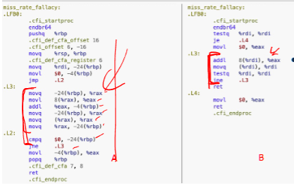

# Cache Aware programming

Created: March 4, 2025 11:50 AM
Tags: Computer Hardware

[problems](https://www.notion.so/problems-1ae81cb71af080d2a310e761ccfbc9db?pvs=21)

### **Overview of Cache-Aware Programming**

- Key aspects include:
    - Organizing data structures.
    - Structuring loops efficiently.
    - Choosing optimal data structures and algorithms.
    - Considering OS and library effects on caching.

### compare to miss rate vs MPI

> **Miss Rate Fallacy**: A lower cache miss rate does not always mean better performance.
> 

**Misses Per Instruction (MPI)**: More accurate than miss rate for understanding memory impact on performance.

### cold start effects

> Initial cache performance is lower before warm-up.
> 
- It causes a temporary slowdown until caches or buffers are populated
- modify the code to reduce number of memory access instructions will also reduce MPI

---

example: find the MPI in the section for each loop, suppose cache line size is 32 bytes 



left: 

```nasm
movq -24(%rbq), %rqx             // cache miss, all -24(%rbq) stored
movl 8(%rax), %eax               // cache miss, 8(%rax) stored
adddl %eax, -4(%rbq)             // cache hit, -4(%rbq)  is stored
movq -24(%rbq), %rax             // cache hit
movq (%rax), %rax                // cache hit
movq %rax, -24(%rbq)             // cache hit
cmpq $0, -24(%rbq)               // cache hit
jne .L3                          // no memory access
```

therefore the MPI is 1/4

right

```nasm
addl 8(%rdi), %eax             //If the total number of instructions per node traversal is 8,
                               // the cache miss ratio would be: 1/8
movq (%rdi), %rdi              //cache hit
testq ....                     //not memory access
lne .....                      //not memory access 
```

- the cache miss rate per instruction is 1/8

# Cache aware programming

### side-effects of cache aware programming

1. side effects of cache-aware programming will make the code
    1. longer
    2. more complicated
    3. harder to understand, modify, debug, and portable 
2. if the code is working well, fix cache behavior is not first priority
    1. unexploited performance optimization are not bugs
    2. only apply optimizations when we have evidence that the performance problem is due to memory behavior 

### spatial locality refresher

- for cache: near: in the same cache line
- for TLB (translational lookaside buffer):
    
    > translate virtual address to physical address
    > 
    - L1: 100 entries
    - L2: 1000 entries
- therefore, it is important to determine **How many cache lines contain a part of the data structure**

---

example: for a 16 byte cache line, how big is `my_struct` in cachelines? 

```c
struct my_struct {
	uint32_t foo[4]
}
```

- each object of `my_struct` would take 1 cache line, if it starts at the start of cache line
- if the start of my_struct is not the start of cache line, it would span over 2 cache lines

---

example: order matters


- 64 byte cache line can store 64 / 4 = 16 ints,
- for version A
    - a, c in every struct would never be stored on the same cache line.
    - therefore, the insturction `a[i].a += a[i].c` can be translate to `addl (%rax), 64(%rax)`
    - therefore, every cache access is a miss, needs to fetch twice per iteration
- for version B, it is likely that a, c will be in the same cache line.
    - therefore, we only miss once when get a, and cache hits when c
- on average, it should reduce the MPI by half

### alignment

> **Alignment**: Ensures data is naturally aligned in memory to prevent inefficient access.
> 

<aside>
💡

`sizeof(datatype)` = number of bytes this datatype holds

</aside>

aligned: `A % n == 0`, A is n byte aligned 

- eg: `sizeof(char)==1`, therefore, they can be anywhere
- eg: `sizeof(uint32_t)==4`, therefore, should be at multiple of 4

**struct aligned:** Final struct size is rounded to a multiple of the largest alignment (8 bytes).

- because
    - unaligned access are sometimes inefficient
- unaligned access
    - in some ISA, may cause an interrupt
- C, C++ require instances of basic types (int, float,…) to be naturally aligned
    - or, the fields of structs is stored in the order they are declared

---

eg: what is the `sizeof(struct_8)`

```c
struct struct_8 {
	uint8_t a;
	uint64_t b;
	uint8_t c;
};
```

- a, c is a size of 8 bits = 1 byte, so it can be placed anywhere
- b is a size of 64 bits = 8 bytes, so it must be aligned to 8-byte boundary
- therefore, the final memory layout is:

| Field | Size (bytes) | Alignment | Offset | Notes |
| --- | --- | --- | --- | --- |
| `a` | 1 | 1-byte aligned | 0 | Starts at 0 |
| **Padding** | 7 | (To align `b` to 8-byte boundary) | 1-7 | Added by compiler |
| `b` | 8 | 8-byte aligned | 8 | Starts at offset 8 (must be aligned) |
| `c` | 1 | 1-byte aligned | 16 | Starts at offset 16 |
| **Padding** | 7 | (To align struct to 8-byte boundary) | 17-23 | Ensures struct alignment |

### Tensor<T>

- a 4D array, but we can set unused dimensions to 1 to reduce dimension
- in following case, suppose `z=1, b=1`, so it is 2D array
- therefore, index of every element is $index = y*(size.x)+ x$


- therefore, all the adjancent x elements are consecutive within a y
- **mostly in row-major**
    - A(i, j) ⇒ access A(y = i, x = j)

### temporal locality refresher

> exists when a program access same memory repeatedly in a short time
> 
- recent accessed memory will be accessed soon
- programs tends to reuse the same memory location frequently within short period

requirements:

1. reuse - must access A more than once
2. the second access must be soon enough
3. **working set must fit the cache to exploit temporal locality** 
    1. to shrink working set, we need to do loop optimization

# Loop optimization

> change the order in which memory operations occur
> 

trade offs:

1. benefits
    1. reduce working set size
2. costs
    1. increase loop overheads

### performance equation

- loop optimization
    - reduce IC, CPI
    - does NOT reduce cycle time (CT), because Loop optimizations do not change the **hardware clock speed**, so the **cycle time remains the same**.

### performance counters

> hardware components in the CPU that track performance-related events
> 

### loop fusion

✅ **Effect**:

- Merges two loops with the same iteration space into one.
- Reduces **cache misses** by improving **temporal locality** (accessing the same data sooner).
    - and reduce loop overheads

⚠ **Trade-offs**:

- Not always applicable if loops have dependencies. (is the loop legal)

---

example: 


- each element would take 4 bytes, and therefore each cache line will store 64/4 = 16 elements.
- therefore, we will have 1 miss for each 16 memory access, those miss are compulsory
- if we translate each loop, there should be 5 instructions per loop block.


- we only access memory once per 5 instructions, and only 1 out of 16 memory access cache miss
- therefore, the result MPI is
    - if the loop size is large enough that the cache will be completely filled (eg `size.x = 16384`)
        - result MPI is 1/5 * 1/16, there are **capacity cache misses**
    - if the loop size is small that all working set can be stored in the cache (eg `size.x  = 4096`)
        - result MPI is 1/10 * 1/16, all cache miss are compulsory
- if we use loop fusion, we have


- we will reduce the MPI after fuse the loop, MPI of unfused / MPI of fused > 1.xxxx ~ 2
    - note: we dont need to increment 2 `i` only 1 `i`
- however, this is affected by the cold start effects

### loop inversion (loop renesting)

✅ **Effect**:

- Changes **loop nesting order** to improve **spatial locality** by accessing memory in a more cache-friendly manner.
- Reduces **stride length**, which is the gap between consecutive memory accesses.
    
    > The stride of a sequence of memory accesses is a consistent distance in bytes between the addresses.
    > 

⚠ **Trade-offs**:

- Changes execution order, which might **affect program correctness**.
- legal renesting?

---

example:


- NOTE: since sensor is directly mapped from b→z→y→x, but here, each iteration, we try to get `a.get(i,j)`, and `a.get(i, j+1)`, which is `x = i, y = j -> j+1`, therefore, the distance between each element access is entire size of x, or 1024 ints

$$
1024 * 4 = 4096 \text{ bytes}
$$

- what is the hit rate of a.get()?
    - since each memory access is 4096 byte apart so we will unable to exploit any spatial locaity, and there are only 32 kb / 64 bytes = 512 lines, and 512 * 64/4 < 1024 * 1024, so cache capacity hits
    - therefore, hit rate is 0%
- if we invert the loop:


- stride distance is 4 bytes
- miss rate is 1/16

---


- the stride distance increase MPI when distance < cache line size, since less memory will be cached when stride distance increases
    - MPI increase rapidly at first. suppose cache line is 32 bytes and stride distance is 0 bytes, each element is an int 4 bytes, therefore, a cache line would store 32 / 4 = 8 ints at first, MPI = 1/8
    - increase stride distance to 4 bytes, a cache line would store 32 / 8 = 4 ints, MPI = 1/4
    - increase to 8 bytes, 32 / 12 ~= 2 in each cacheline MPI = 1/4
    - …
    - when stride distancfe  > 28 bytes, every try is a cache miss, therefore, MPI = 1 forever
    
    $$
    MPI =(4 + SD) / 32
    $$
    
    - b

---

Consider this **tensor<>** :

```c
tensor_t<float> A(M, N);  // M rows, N columns
```

Each element is a float, which takes 4 bytes.

Below is the definition of get():

```c
float get(tensor_t<float> &A, int i, int j)
{
    return A(i, j);
}
```

---

If we iterate by increasing index **j**, what is the stride (in bytes) of memory accesses? Select the correct answer.

### loop fission

✅ **Effect**:

- Splits a large loop into multiple smaller loops, each handling a subset of operations.
- Can **reduce working set size** if different operations use different data.

⚠ **Trade-offs**:

- Increases **loop overhead** (multiple loops mean more iterations).
    - but it may actually reduce the instruction count
- Reduces **cache pressure** but may increase instruction overhead.
- does not help performance


---

```cpp
for (int i = 0; i < N; i++) {
    A[i] = B[i] + C[i];  // First computation
    D[i] = E[i] * F[i];  // Second computation
}

```

**After (Loop Fission Applied)**

```cpp
cpp
CopyEdit
for (int i = 0; i < N; i++) {
    A[i] = B[i] + C[i];  // First loop
}

for (int i = 0; i < N; i++) {
    D[i] = E[i] * F[i];  // Second loop
}

```

### loop tiling (blocking)

✅ **Effect**:

- Breaks loops into smaller blocks that **fit into cache**, improving **temporal locality**.
    - if tiles are smaller than cache, misses should be eliminated.
    - Optimizes data locality by accessing nearby elements before moving to new memory regions.
        - Improves cache efficiency by increasing data reuse within a block.
- **reduce the working se size of loop**
    - Reduces memory bandwidth usage by keeping smaller working sets in cache.

⚠ **Trade-offs**:

- Increases **loop overhead** due to extra inner loops.
- May not always provide benefits if tiles are not chosen optimally.

---

```c
// Before tiling (bad cache usage)
for (int i = 0; i < N; i++)
    for (int j = 0; j < N; j++)
        A[i][j] = B[i][j] + C[i][j];

// After tiling (better cache usage)
int T = 16;  // Tile size
for (int ii = 0; ii < N; ii += T)
    for (int jj = 0; jj < N; jj += T)
        for (int i = ii; i < ii + T; i++)
            for (int j = jj; j < jj + T; j++)
                A[i][j] = B[i][j] + C[i][j];
```

---

example:


- what happen to the number of cache misses?
    - cache misses remain constant
- what happen to execution time
    - Might increase or decrease, depending on the value of block_size
        - depends on if the block size properly exploits spatial locality
- suppose there are 64 byte cache lines, what block_size will ensure you only get one miss per cache line?
    - the cache line size is 64 bytes, and each element is int (4 bytes). therefore, 16 elements per cache line
    - therefore, the `block_size = 16` to fit in a tile

# Data structure

| Data
  Structure | Insert | Delete | Search | Lookup | Memory Efficiency | Cache Misses |
| --- | --- | --- | --- | --- | --- | --- |
| std::vector<> (or `array`) | O(1) append | O(n) insert/delete | O(n) search | O(1) lookup | 100% (just an array) | O(n) for scan (1/8 per uint64_t),
  O(log n) for bin-search |
| std::list<> (Doubly Linked List) | O(1) append | O(1) insert/delete | O(n) search | N/A | Low (Each node ≥ 24 bytes) | O(n) misses for search (constant
  factor 1 for uint64_t), O(1) for insertion |
| std::map<>
  / std::set<> (Red-Black Tree) | O(log n) | O(log n) | O(log n) | O(1) next largest element | ~64 bytes per node (low) | O(log n) misses (adds 1 miss per
  tree size doubling) |
| std::unordered_map<>
  / std::unordered_set<> (Hash Table - Open Chaining) | O(1) | O(1) | O(1) | O(n) next largest | Similar to std::set<> (each
  node ≥ 24 bytes) | O(1) misses lookup (bounded at 2
  misses per query) |

### map

> uses binary tree, red-black
> 

$$
depth (D) = O(2\log{(n)})
$$

- since this is a red-black binary tree, therefore, the D - 1 level map must be a complete binary tree
- therefore, $2^{D-1} - 1 \le n \le 2^D - 1$

$$
2^{D-1} - 1 \le n \le 2^D - 1 \\
D - 1 \le \log(n) \le D \\
\log(n) \le D \le 2\log(n)
$$

---

example: 

Consider a balanced binary tree of depth **D = 8** (i.e., each path from the root to a leaf contains exactly **D** nodes).

- Each node contains two pointers.
- Pointers are **64** bits.
- Cache lines are **32** bytes.
- The nodes of the tree are **distributed randomly across a very large region of memory** and they are cacheline-aligned.

After constructing the tree, the program repeatedly **queries** it, and all searches terminate at a leaf.

**How large (in bytes) must the cache be to avoid nearly all capacity misses? (Assume the cacheline size and number of cachelines in the cache are both powers of 2).**

**Hint:** How many nodes are there in a balanced tree of depth **D**? Try some small numbers to figure it out.

<aside>
💡

note: each map node has 2 pointers: left child and right child. therefore, the node struct size is 8 bytes

</aside>

- the pointer is 64 bits = 8 bytes, a node has 2 childrne pointers, so the size of node is 16 bytes
- since The nodes of the tree are **distributed randomly across a very large region of memory** and they are cacheline-aligned. each node takes the entire cache line,
- so $2^8 * 32 = 8192$ (since it wants power of 2)

### struct

- rearange the fields of a struct:
    - may reduce/increase size
    - improve/worsen spatial locality
    - DOES NOT  help ensure fields are naturally aligned

---

example: 

For an object, `a`, `sizeof(a) == 32` and `&a = 0x0000402c`. The cache line size is `64` bytes.

Assuming the cache is initially empty, how many cache misses will occur if the program accesses every field of `a`?

since the cache line size is 64 bytes, therefore, each interval is 64/16 = 4, or `0x40`. therefore, the intervals include:

- `0x00004000` - `0x0000403F`,

and since `0x0000402C + 0x00000020` = `0x0000404C`, it would span over 2 intervals, therefore cause 2 cache misses. 

---

Imagine that you have a doubly linked list with **X** elements in it, and the elements of the linked list are distributed randomly throughout a large region of memory. In addition to the pointers, each link in the list also contains a **64-bit** integer.

Your cache is fully associative, has **X** cache lines, and a cache line size of **64 bytes**. The system uses **64-bit addresses**. However, you find that each time you traverse the list, you incur **2*X** cache misses.

Which of the following changes would reduce the number of **capacity misses** to zero and reduce the number of **compulsory misses** by half? Select all that apply.

Checkbox options[ ] 

(a)Reducing associativity[x] 

(b)Ensuring that the links were aligned to the beginning of a cache line[x] 

(c)Increasing cache line size (with a matching increase in overall cache size)[ ] 

(d)Using a write-through cache policy

- since the linked list has X elements, and each elemnt has 2 pointers and a 8 byte integer, therefore, the size of single element is 8 *3 = 24 bytes
- 64 /24 result is not a complete integer. however, if distributed rnadomly in the memory, they are not aligned continously. → C is wrong because we cannot ensure they are continous
- reducing associativity does not reduce capacity misses, since it will only increase possibiliy of capacity misses
- if the element is not cache line aligned, then it is possible that we will encounter 2 cache misses perinstruction if the element is spanning 2 cache lines.
- A **write-through policy** only affects **write operations**, ensuring that every write propagates immediately to main memory.
- It does **not reduce compulsory or capacity misses**.
- Read accesses (which cause the traversal misses) **remain unaffected** by this change.

---


