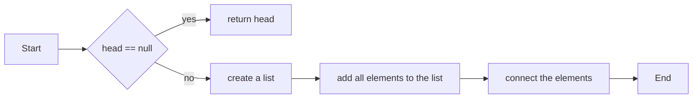

# Sort List

[leetcode](https://leetcode.com/problems/sort-list/description/)

!!! note "Review" this is a basic sorting problem, we can use merge sort to solve this problem.

??? info "Added Date" 2021-09-30

## Problem

Given the head of a linked list, return the list after sorting it in ascending order.


> Input: head = [4,2,1,3] Output: [1,2,3,4]

## workflow



## solution

=== "java" ```java title="Merge Sort" linenums="1" hl_lines="1" public ListNode sortList(ListNode head) { if (head ==
null) return head;

            List<ListNode> list = new ArrayList<>();
            while (head != null) {
                list.add(head);
                head = head.next;
            }

            Collections.sort(list, (a, b) -> a.val - b.val);

            for (int i = 1; i < list.size(); i++)
                list.get(i - 1).next = list.get(i);

            list.get(list.size() - 1).next = null;

            return list.get(0);
        }
    ```

=== "js"
`javascript title="Merge Sort" linenums="1" hl_lines="1" /** function sortList(head: ListNode | null): ListNode | null { // merge sort if (!head) return null; //divide if (!head.next) return head; let fast = head, slow = head; while (fast && fast.next && fast.next.next) { slow = slow.next; fast = fast.next.next; } const oh2 = slow.next; slow.next = null; let l1 = sortList(head); let l2 = sortList(oh2); let dummy = new ListNode(1); let cur = dummy; while (l1 && l2) { if (l1.val < l2.val) { cur.next = l1; l1 = l1.next; } else { cur.next = l2; l2 = l2.next; } cur = cur.next } while (l1) { cur.next = l1; l1 = l1.next; cur = cur.next } while (l2) { cur.next = l2; l2 = l2.next; cur = cur.next } return dummy.next; }; `
