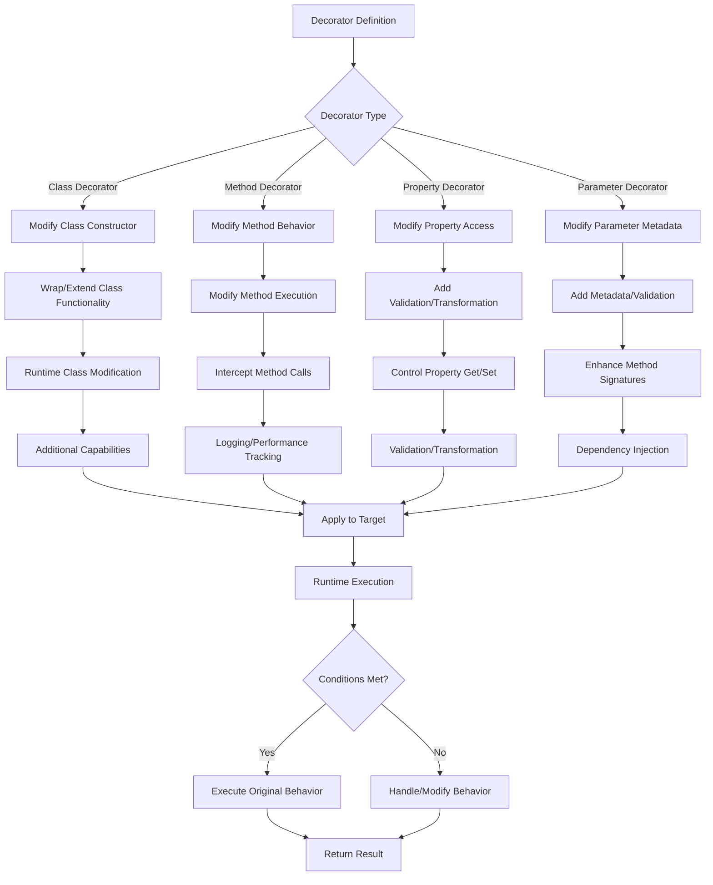

# Typescript Decorator

[:fontawesome-solid-download: download source ts](scripts/decorator.ts){.md-button .md-button--primary}

### Decorator Workflow



### Decorator Composition

Multiple decorators can be applied to a declaration, for example on a single line:

```typescript
@f @g x
method() { ... }
```

## Declare a Decorator Factory

```typescript
  function ActualDecorator(
    target: any, // (1)
    propertyKey: string, // (2)
    descriptor: PropertyDescriptor) { // (3)
    ...
  }
```

1. `target` The target is the constructor function if we apply the decorator to a **static member** and the
   **prototype** of the class if it is applied on an instance property.
2. `propertyKey` is the **name** of the decorated method, example: `add`
3. `descriptor` is the property descriptor of that method.
    ```typescript
    interface PropertyDescriptor {
        configurable?: boolean;
        enumerable?: boolean;
        value?: any;
        writable?: boolean;
    }
    ```

### Decorator Evaluation order:

1. Parameter Decorators, followed by Method, Accessor, or Property Decorators are applied for each _**instance**_
   member.
2. Parameter Decorators, followed by Method, Accessor, or Property Decorators are applied for each **_static_** member.
3. Parameter Decorators are applied for the **_constructor_**.
4. Class Decorators are applied for the _**class**_.

### class decorator

=== "Decorator"

    ```typescript title="Class Decorator"
    function LogClassDecorator(constructor: Function) {
        console.log("constructor:", constructor);
    }
    ```

=== "Usage"

    ```typescript
    @LogClassDecorator
    class Foo { ...}
    ```

=== "Output"

    ```powershell
    constructor: [class Foo] # (1)
    ```

    1. accessible by `constructor.name`

### Method Decorators

=== "Decorator"

    ```typescript linenums="1"
    function LogDebugInfo(
      pattern: string = "[{name}]({params}) -> {result}\nTime {time} ms") {
      return function (
        target: any,
        propertyKey: string,
        descriptor:PropertyDescriptor){
        const originalMethod = descriptor.value; // (1)!
        descriptor.value = function (...args: any[]) { // (2)
            const start = performance.now(); // (3) (4)?
            const res = originalMethod.apply(this, args);
            const end = performance.now();
            const time = end - start;
            console.log(
                pattern
                    .replace("{name}", propertyKey)
                    .replace("{params}", args.join(", "))
                    .replace("{result}", res)
                    .replace("{time}", time.toString())
            );
        };
      };
    }
    ```

    1. `descriptor.value` is a `Function` interface, `descriptor.value.toString()` =>
      ```powershell
      add(a, b) {
          return a + b;
      }
      ```
    2. `descriptor.value` is the decorated function that will be called. when the function is called, `args` will be passed in.
    3. `performance` is from Performance API. which provides high-resolution timestamps and methods to measure the performance of your code
    4. `performance.now()` gives the time relative to the time the page or Node.js process started.

=== "Usage"

    ```typescript
    @LogDebugInfo()
    function add(a: number, b: number): number {
        return a + b;
    }

    console.log(add(1, 2)); // Output: 3
    ```

=== "Output"

    ```
    [add](1, 2) -> 3
    Exec Time: 0.010499999999979082 ms
    ```

### Accessor Decorator

=== "Decorator"

    ```typescript
    function LogAccessorDecorator(target: any, key: string, descriptor: PropertyDescriptor) {
        console.log("target:", target);
        console.log("key:", key);
        console.log("descriptor:", descriptor);
      }
    ```

=== "Usage"

    ```typescript
    class Foo {
        private _pv: number;
        @LogAccessorDecorator
        get pv(): number {
            return this._pv;
        }
    }
    ```

=== "Output"

    ```
    target: {}
    key: pv
    descriptor: {
      get: [Function: get pv],
      set: undefined,
      enumerable: false,
      configurable: true
    }
    ```

### Property Decorator

=== "Decorator"

    ```typescript
    function LogPropertyDecorator(target: any, key: string) {
      console.log("target:", target);
      console.log("key:", key);
    }
    ```

=== "Usage"

    ```typescript
    class Foo {
      @LogPropertyDecorator
      private _pv: number;
    }
    ```

=== "Output"

    ```
    target: {}
    key: _pv
    ```

### Parameter Decorator

=== "Decorator"

    ```typescript
    function LogParameterDecorator(target: any, key: string) {
        console.log("target:", target);
        console.log("key:", key);
    }
    ```

=== "Usage"

    ```typescript
    @LogParameterDecorator
    id: number = 0;
    ```

=== "Output"

    ```
    target: {}
    key: id
    ```

# Examples:

### (1): Log Method Debug Info

=== "Description"

    write a method decorator that logs the method name, arguments, and return value of the method, and its execution time.

=== "Decorator"

    ```typescript linenums="1"
      function LogDebugInfo(
        target: any, // (1)
        propertyKey: string, // (2)
        descriptor: PropertyDescriptor) { // (3)
           const originalMethod = descriptor.value;

           descriptor.value = function (...args: any[]) {
             const start = performance.now();
             const result = originalMethod.apply(this, args);
             const end = performance.now();
             console.log(`Execution time for ${propertyKey}: ${end - start} ms`);
             return result;
           };

           return descriptor;
      }
    ```

=== "Usage"

     ```typescript linenums="1"
      class Foo {
          constructor() {
              console.log('Foo constructor called');
          }
          @LogDebugInfo
          add(a: number, b: number): number {
              return a + b;
          }
          @LogDebugInfo
          static multiply(a: number, b: number): number {
              return a * b;
          }
      }

      const foo = new Foo();
      console.log(foo.add(1, 2)); // Output: 3
      console.log(Foo.multiply(2, 3)); // Output: 6
     ```

### (2) Min Field Length

=== "Description"

    Implement a property decorator @MinLength(len: number) that ensures a string property has at least len characters.

    ```typescript
    class User {
      @MinLength(5)
      username: string;

      constructor(username: string) {
        this.username = username;
      }
    }
    ```

=== "Solution"

    ```typescript linenums="1"
    function MinLength(len: number) {
      return function (target: any, propertyKey: string) {
        let value: string;
        const descriptor: PropertyDescriptor = {
            get() {
                return value;
            },
            set(newValue: string) {
                if (newValue.length < len) {
                    throw new Error(`${propertyKey} must be at least ${len} characters long`);
                }
                value = newValue;
            },
            enumerable: true,
            configurable: true,
        };
        Object.defineProperty(target, propertyKey, descriptor);
      };
    }

    ```

=== "Example 1"

    ```typescript linenums="1"
    // Detailed implementation with console logs to track each stage
    function MinLength(len: number) {
        console.log(`[Decorator Factory] MinLength called with length: ${len}`);

        // Decorator function that will be applied to the property
        return function(target: any, propertyKey: string) {
            console.log(`[Decorator] Applied to target:`, target);
            console.log(`[Decorator] Property key: ${propertyKey}`);

            // Storage for the actual value
            let value: string;

            // Create property descriptor
            const descriptor: PropertyDescriptor = {
                // Getter
                get() {
                    console.log(`[Getter] Retrieving value: ${value}`);
                    return value;
                },

                // Setter with validation
                set(newValue: string) {
                    console.log(`[Setter] Attempting to set value: ${newValue}`);

                    // Validation logic
                    if (newValue.length < len) {
                        console.log(`[Validation] Length check failed`);
                        throw new Error(`${propertyKey} must be at least ${len} characters long`);
                    }

                    console.log(`[Validation] Length check passed`);
                    value = newValue;
                },
                enumerable: true,
                configurable: true
            };

            // Replace the property with our custom descriptor
            console.log(`[Property Definition] Defining property with custom descriptor`);
            Object.defineProperty(target, propertyKey, descriptor);
        };
    }

    // User class with the decorator
    class User {
        @MinLength(5)
        username: string;

        constructor(username: string) {
            console.log(`[Constructor] Creating user with username: ${username}`);
            this.username = username;
        }
    }
    ```

=== "Usage 1"

    ```typescript
    // Demonstration of different scenarios
    console.log("--- Scenario 1: Valid Username ---");
    try {
        const user = new User("johndoe");
        console.log(`Created user with username: ${user.username}`);
    } catch (error: any) {
        console.error(error.message);
    }

    console.log("\n--- Scenario 2: Invalid Username ---");
    try {
        const user = new User("john");
    } catch (error: any) {
        console.error(error.message);
    }

    console.log("\n--- Scenario 3: Changing Username After Creation ---");
    try {
        const user = new User("johndoe");
        console.log(`Initial username: ${user.username}`);

        // Attempt to change username
        user.username = "a";
    } catch (error: any) {
        console.error(error.message);
    }
    ```

=== "Output 1"

    ```
    [Decorator Factory] MinLength called with length: 5
    [Decorator] Applied to target: {}
    [Decorator] Property key: username
    [Property Definition] Defining property with custom descriptor
    --- Scenario 1: Valid Username ---
    [Constructor] Creating user with username: johndoe
    [Setter] Attempting to set value: johndoe
    [Validation] Length check passed
    [Getter] Retrieving value: johndoe
    Created user with username: johndoe

    --- Scenario 2: Invalid Username ---
    [Constructor] Creating user with username: john
    [Setter] Attempting to set value: john
    [Validation] Length check failed
    username must be at least 5 characters long

    --- Scenario 3: Changing Username After Creation ---
    [Constructor] Creating user with username: johndoe
    [Setter] Attempting to set value: johndoe
    [Validation] Length check passed
    [Getter] Retrieving value: johndoe
    Initial username: johndoe
    [Setter] Attempting to set value: a
    [Validation] Length check failed
    username must be at least 5 characters long
    ```
